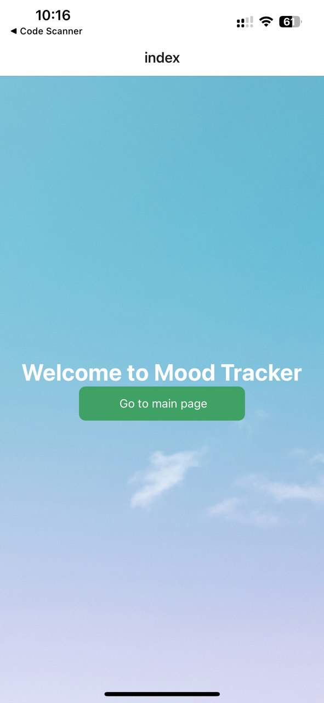
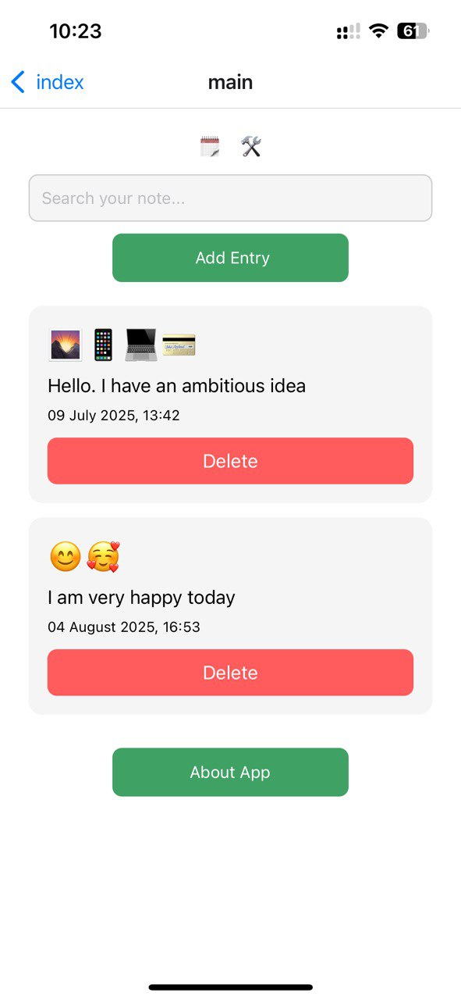
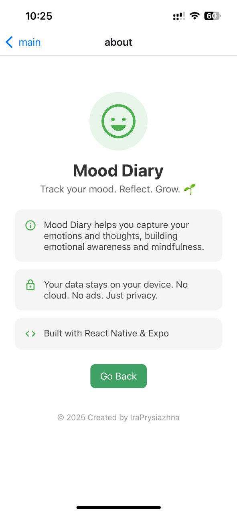
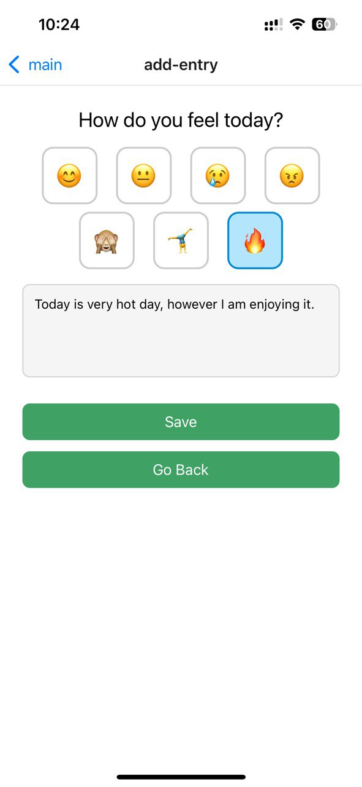
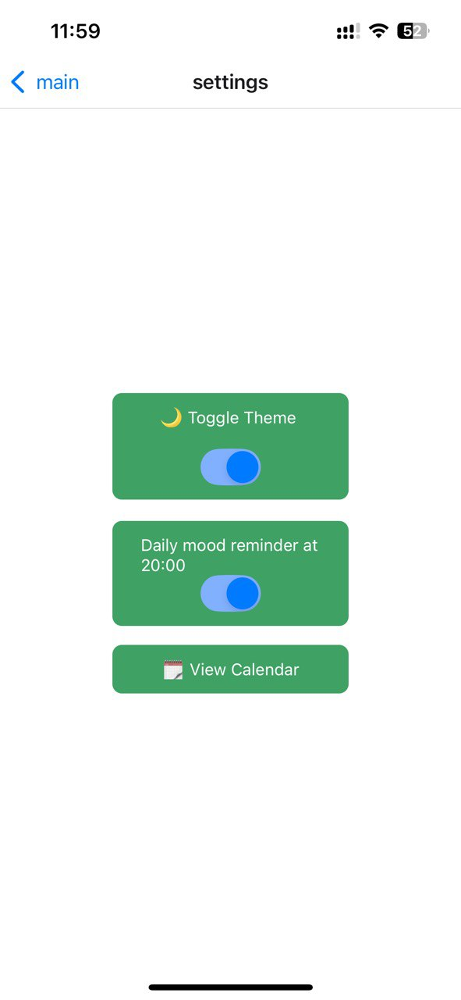
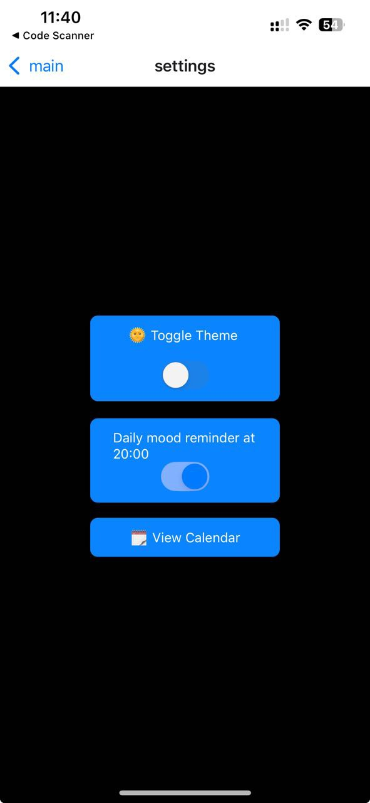
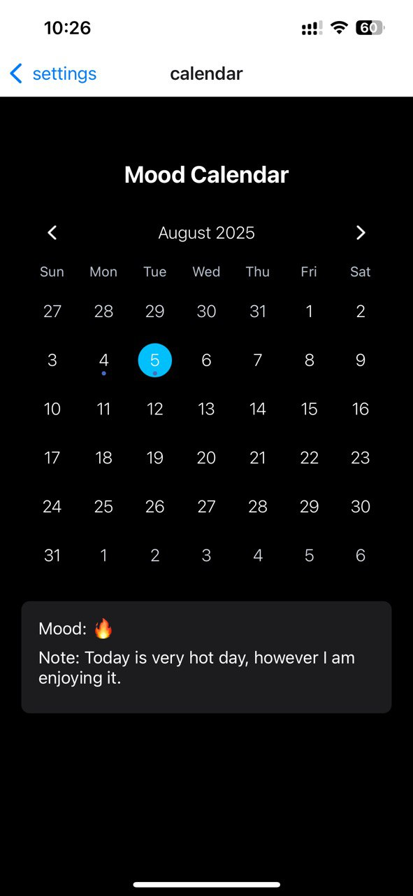
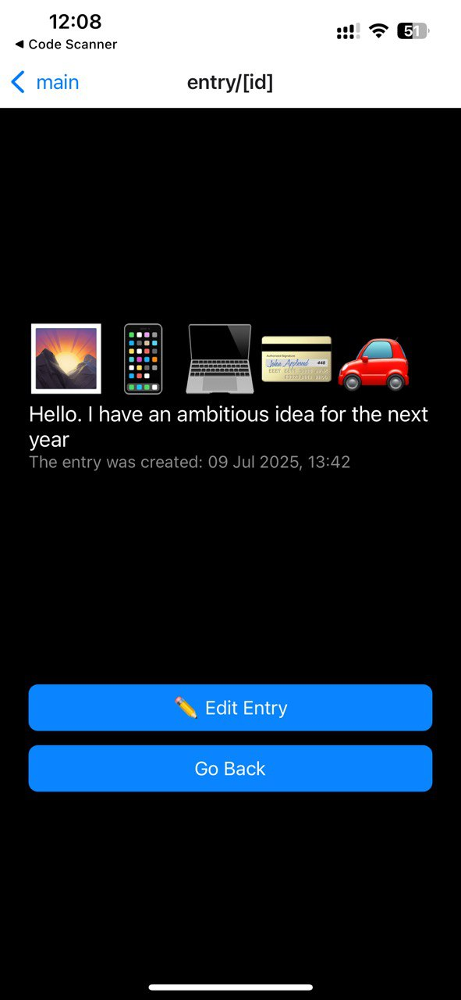
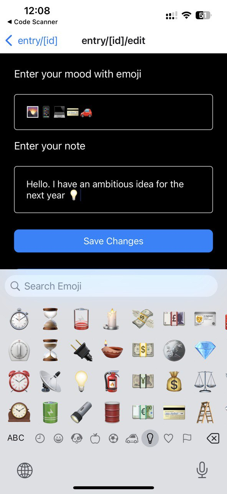

# MoodMate

MoodMate is a mobile app built with React Native and Expo. It allows users to track and reflect on their daily mood, view their mood history on a calendar, and set daily reminders to record their emotional well-being. The goal is to support mental self-care through a simple and intuitive interface.

## Features

- Add Mood Entries: Users can log their mood, description, and date.

- Mood History View: View all past mood entries in a scrollable list.

- Calendar View: Visualize mood history with marked dates on a calendar.

- Search Functionality: Quickly find mood entries by keyword.

- Dark/Light Theme Support: Auto-adapts to system theme or user preference.

- Local Storage Persistence: Mood entries and settings are saved on device.

- Daily Reminders: Push notifications to remind users to record their mood.

### Key Functionalities

#### Welcome Page

- Displays a greeting and allows users to move to main page.

#### Main Page

- Navigation to Calendar and Mood History pages.

- Display a button to move to settings.

- Implemented search bar to filter by keyword.

- Displays all entries sorted by date.

- Shows a button to create a new mood entry.

- Navigation to page with info about the app.

#### Add Entry Page

- Form to select mood (with icons), add description, and choose date.

- Stores entry locally via AsyncStorage.

#### Settings

- Implemented Theme Toggle with React Context API and useColorScheme().

- Uses expo-notifications to schedule daily reminders.

- Allows users to enable/disable notifications via toggle.

- Stores notification preference in AsyncStorage.

#### Calendar Page

- Uses react-native-calendars to show which days have mood entries.

- Tapping a date displays associated entry if available.
  

#### Edit Page

- Created opportunity to edit an entry.

### 📦 Technologies Used

##### Frameworks & Languages

- React Native with Expo

- TypeScript

##### Navigation

- expo-router — file-based routing system with dynamic routing support

###### State & Context

- React Hooks (useState, useEffect, useContext, createContext)

- AsyncStorage — persistent local data storage

##### UI & UX

- @expo/vector-icons — icons for moods and UI

- ScrollView, Switch, TouchableOpacity, Alert — native components

###### Calendar

- react-native-calendars — displays mood entries by day

##### Notifications

- expo-notifications — for local push reminders

## 🔧 Installation

1. Clone the repository

- git clone https://github.com/PrysiazhnaIra/MoodMate.git

2. Install dependencies

- npm install

3. Start the project

- npx expo start

4. Run on your device

- Scan the QR code with Expo Go or run on emulator/simulator.

### 🚀 Deployment

Since it's a React Native app, you can build and publish via Expo:

- npx expo build:android
- npx expo build:ios

Or publish to Expo hosting:

- npx expo publish

### Author

**Ira Prysiazhna**  
🔗 [GitHub](https://github.com/PrysiazhnaIra)  
🔗 [LinkedIn](https://www.linkedin.com/in/prysiazhna-ira)
